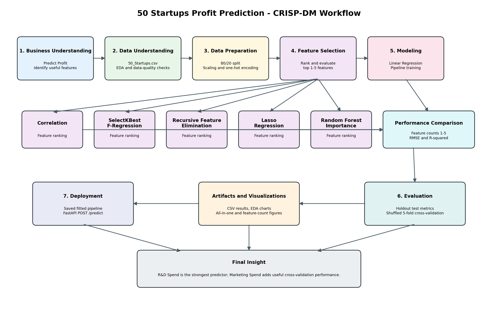
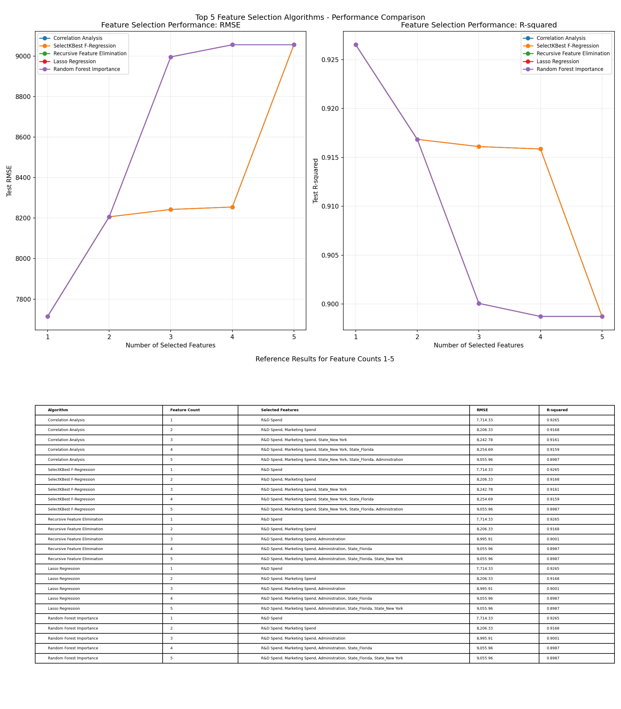
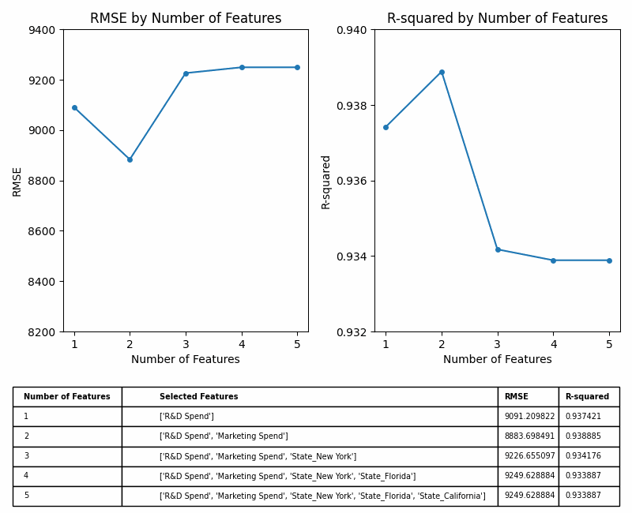

# HW6: Startup Profit Prediction

Machine-learning regression project using the `50 Startups` dataset and the
CRISP-DM workflow. The project predicts startup profit, compares five
feature-selection algorithms, generates performance visualizations, and exposes
the fitted Linear Regression pipeline through FastAPI.



## Key Results

- `R&D Spend` is consistently the strongest profit predictor.
- `Marketing Spend` is consistently the second strongest feature.
- The best holdout result uses only `R&D Spend`:
  - RMSE: `7,714.33`
  - R-squared: `0.9265`
- Shuffled five-fold cross-validation favors `R&D Spend` and
  `Marketing Spend`:
  - RMSE: `8,883.70`
  - R-squared: `0.9389`
- The deployed full Linear Regression pipeline achieves:
  - Test RMSE: `9,055.96`
  - Test R-squared: `0.8987`

## Feature Selection

Five feature-selection algorithms are evaluated for feature counts 1-5:

1. Correlation Analysis
2. SelectKBest F-Regression
3. Recursive Feature Elimination
4. Lasso Regression
5. Random Forest Feature Importance





## Project Structure

| Path | Purpose |
|---|---|
| `train_linear_regression.py` | Complete training, evaluation, and visualization workflow |
| `50_Startups.csv` | Source dataset |
| `HW6.md` | Detailed project report |
| `app.py` | FastAPI prediction service |
| `artifacts/` | Generated figures, metrics, and fitted model |
| `requirements.txt` | Python dependencies |

## Run the Project

Install dependencies:

```powershell
pip install -r requirements.txt
```

Run training and regenerate all artifacts:

```powershell
python .\train_linear_regression.py
```

Start the prediction API:

```powershell
uvicorn app:app --reload
```

Open the interactive API documentation at:

```text
http://127.0.0.1:8000/docs
```

## Documentation

See [HW6.md](HW6.md) for the full CRISP-DM analysis, feature-selection results,
model evaluation, limitations, and deployment details.
