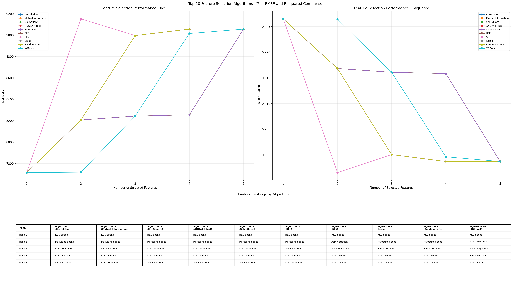

# HW6：50 Startups 獲利預測

本專案使用 Kaggle `50_Startups.csv` 資料集，依照 **CRISP-DM** 流程建立新創公司獲利預測模型。流程包含資料理解、資料前處理、10 種特徵選擇演算法比較、線性迴歸模型評估，以及 FastAPI 模型部署。

## Live Demo

| Platform | URL | Description |
|---|---|---|
| Technique WhitePaper | [WhitePaper.md](WhitePaper.md) | 超過 20,000 字的完整技術白皮書，說明 CRISP-DM、10 種特徵選擇方法、模型評估、互動式 Dashboard、風險治理與未來發展。 |
| Infographic | [Kaggle50startup.png](Kaggle50startup.png) | Hand-drawn Excalidraw-style infographic |
| NBLM ppt | [Startup_Profit_Prediction.pptx](Startup_Profit_Prediction.pptx) | 完整簡報檔，整理新創公司獲利預測流程、資料分析、模型比較與主要研究結論。 |
| 動態影音 | [Startup_Profit_Prediction_Animated.mp4](Startup_Profit_Prediction_Animated.mp4) | 動態影音版專案導覽，以視覺化方式呈現 CRISP-DM 流程、特徵選擇與模型成果。 |

## 專案目標

使用下列特徵預測新創公司的 `Profit`：

- `R&D Spend`
- `Administration`
- `Marketing Spend`
- `State`

## 10 種特徵選擇演算法

本專案比較以下方法：

1. Correlation
2. Mutual Information
3. Chi-Square
4. ANOVA F-Test
5. SelectKBest
6. RFE
7. SFS
8. Lasso
9. Random Forest
10. XGBoost

資料經標準化及 One-Hot Encoding 後，共有 5 個可排名特徵。圖表比較每種演算法依序加入 Rank 1 至 Rank 5 特徵後的 Test RMSE 與 Test R-squared。

## 特徵選擇效能比較


## 10 種演算法排名比較

下方表格以 `Rank` 為列，並以 `Algorithm-1 (Correlation)` 至 `Algorithm-10 (XGBoost)` 為欄，顯示各演算法產生的特徵排名。



## 最佳結果

10 種方法的 Rank 1 都是 `R&D Spend`。僅使用此特徵時，各方法得到相同的最佳測試集表現：

| 指標 | 結果 |
|---|---:|
| Test RMSE | **7,714.33** |
| Test R-squared | **0.9265** |
| 最佳特徵 | **R&D Spend** |

若需選擇單一方法，Correlation 計算速度快、結果容易解釋，且在本資料集取得相同最佳效能。

## 執行方式

安裝相依套件：

```powershell
pip install -r requirements.txt
```

訓練模型並重新產生圖表：

```powershell
python .\train_linear_regression.py
```

啟動 FastAPI：

```powershell
uvicorn app:app --reload
```

互動式 Dashboard：

```text
http://127.0.0.1:8000/
```

Dashboard 可調整模型、10 種特徵選擇演算法、Top-K 特徵數、測試集比例、
Random State、樹模型參數與新創公司支出資料，並即時顯示 RMSE、R-squared、
特徵排名、實際值與預測值，以及單筆 Profit 預測。

API 文件：

```text
http://127.0.0.1:8000/docs
```

## 主要輸出

| 檔案 | 說明 |
|---|---|
| `train_linear_regression.py` | CRISP-DM 訓練、評估及輸出流程 |
| `dashboard.html` | 本地端互動式模型分析 Dashboard |
| `app.py` | Dashboard 分析 API 與模型預測 API |
| `artifacts/feature_selection_performance_allinone.csv` | 10 種演算法、不同特徵數量的完整評估結果 |
| `artifacts/feature_selection_results.csv` | 各特徵選擇方法的分數與排名 |
| `artifacts/feature_selection_performance_allinone.png` | Test RMSE、R-squared 與排名綜合圖表 |
| `artifacts/feature_selection_10_algorithms_comparison.png` | 10 種演算法比較圖表 |
| `artifacts/best_model.joblib` | FastAPI 可載入的訓練模型 |
